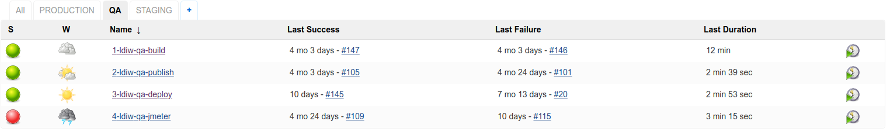
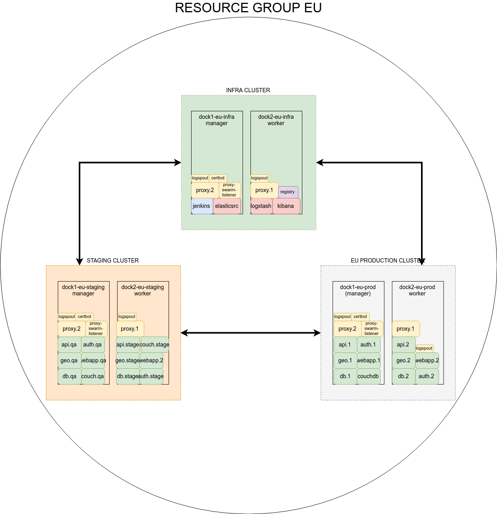
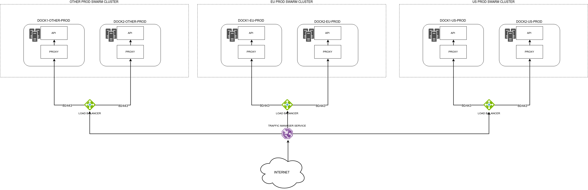

# LDIW swarm project files


## Contents

- [About](#about)
  - [Repo directory structure](#repo-directory-structure)
- [Requirements](#requirements)
  - [Operating System](#operating-system-requirements)
  - [Software](#software-requirements)
- [Configuration](#configuration)
  - [Cloud services](#cloud-services)
  - [Host configuration](#host-configuration)
  - [Docker preconfiguration](#docker-preconfiguration)
  - [Clusters](#clusters)
- [Deployment](#deployment)
  - [Deployment Pipelines](#deployment-pipelines)
  - [Development (workstation) deployment](#development-(workstation)-deployment)
  - [QA/Staging deployment](#staging-deployment)
    - [Staging URLs](#staging-urls)
  - [Production deployment](#production-deployment)
    - [Production URLs](#production-urls)
- [Backup and monitoring](#backup-and-monitoring)
  - [Backup](#backup)
  - [Monitoring](#monitoring)
- [Diagrams](#diagrams)

## ABOUT
This is the project holding swarm configuration files for the [LDIW PROJECT](https://gitlab.qualitance.com/groups/ldiw) services. The project holds configuration files for both the development environments (qa, staging) and also for the production environment.
The development environment configuration files are located under the [staging](./staging) directory.
The production environment configuration files are located under the [prodution](./production) directory.

### Repo directory structure
This repository has a directory structure organized on different directories at the root level. Each directory has an **app** subdirectory (if applicable) and in the root there are templates for 
infrastructure apps. Each directory corresponds to a certain deployed cluster, based on role:

- [infra](./infra) - This contains templates and scripts for the deployment of the software infrastructure needed to support the main application stack: reverse-proxy, certbot, ELK stack,registry, jenkins. This directory does not contain an **app** subdirectory, as this cluster is only for running supporting services; 
- [production](./production) - In the root there are templates for minimal supporting services (certbot, proxy, log routing). Under the [production/app](./production/app) subdirectory there is the 
application template to be deployed on the **production** cluster(s).
- [staging](./staging) - In the root there are templates for minimal supporting services (certbot, proxy, log routing). Under the [staging/app](./staging/app) subdirectory there is the 
application template to be deployed on the **staging** cluster, that holds the **QA** and **STAGING** environments.
- [support](./support) - This directory holds documentation and supporting files and scripts.


## Requirements
### Operating system requirements
For the cluster deployments on staging and production clusters, **Ubuntu 16.04.2 LTS x64** was used.
On local environments, the service stack was built on various Linux distributions and OSX versions.

### Software Requirements
For the **cluster deployments** the main requirement is [Docker Engine](https://docs.docker.com/engine/). You can find detailed installation instructions for Ubuntu [here](https://docs.docker.com/install/linux/docker-ce/ubuntu/). On the staging and production clusters, version `17.06.0-ce` of `docker-ce` vas deployed. More recent versions should be backward compatible and should support the existing deployment templates (compose files) and deployed applications.

For **local deployments** please install the latest [docker-ce](https://docs.docker.com/install/linux/docker-ce/ubuntu/) and [docker-compose](https://docs.docker.com/compose/install/#install-compose) for starting the application stack.


## Configuration
### Cloud Services
Development and production clusters have been deployed on Microsoft Azure, using Standard A2v2 and Standard A4v2 instances.
The following AWS services are used:
- **VM** - cluster nodes are deployed on Linux based virtual machines;
- **Storage account** - asset storage, backup storage, blob storage;
- **Traffic Manager** - Geographic traffic management;
- **VPN** - VPNs must be configured between geographic nodes in order for database replication, log management, docker image management to work;
- **CDN** - distribution of assets stored on storage accounts;
- **Load Balancer** - redirection and load balancing of requests to the docker clusters;


### Host configuration
Host configuration is minimal.
- After starting the VM instance, installation of `docker-ce` is needed and the host must be joined in the existing docker cluster.
- `/etc/fstab` must be configured to mount CIFS volumes and swapfile on boot.
- `/opt/deploy/`, `/backup/` directories should be created.


### Docker preconfiguration
The one time creation of **docker networks** is needed. The deployment templates describe these resources as external. All services are deployed inside the same docker overlay network in order to be 
able to communicate with each other.

On clusters that host multiple logical environments (staging), separate docker networks are required for each environment, so that separation of services must exist.


### Clusters
The **QA** ,**STAGING** and **PRODUCTION** environments run on top of docker swarm clusters. These environments are split between two physical clusters (the **staging** and the **production** clusters) as can be seen from the [cluster diagram staging](./support/cluster-staging.png) and [cluster diagram production](./support/cluster-production.png).

To provide support for builds, logging and other needed infrastructure, the **INFRA** physical cluster is also deployed alongside the application clusters [cluster diagram infra](./support/cluster-infra.png).. 

The following stacks have deployable templates in this repository: 

1. **Infrastructure**
	- elasticsearch
	- [kibana](https://logging.ops.worldcleanupday.com)
	- logstash
	- logspout
	- certbot
	- [registry](https://registry.ops.worldcleanupday.com/)
2. **Proxy**
	- proxy ([docker flow proxy](https://github.com/vfarcic/docker-flow-proxy))
	- swarm-listener (part of dfp project)
	- certbot ([letsencrypt-companion for docker flow proxy](https://hub.docker.com/r/hamburml/docker-flow-letsencrypt/))
3. **Application**
	- api
	- auth
	- db
	- geo
	- couchdb
	- webapp


## Deployment
### Deployment pipelines
[Jenkins](https://jenkins.ops.worldcleanupday.com) has **job list** views that that correspond to the cluster virtual environments (qa, staging, production).

.

The pipeline for building and deployment on one of the **development** environments is started by running the **build** job, eg. _1-ldiw-qa-build_. After finishing, the **publish** job is 
automatically started, which in turn starts the **deploy** job.
- the **build** job pulls all repos and uses the scripts in the devops repo to build container images
- the **publish** job pushes the previously built images to a local docker registry. The docker registry is available on `localhost:5000` on the staging cluster.
- the **deploy** job uses the LDIW-swarm repo to start the application containers.


The name of the pipeline jobs starts with a number which represents the order in which the jobs will run.


### Development (workstation) deployment
Services should be deployed using the scripts present in the [devops](https://gitlab.qualitance.com/ldiw/devops) repository.  

1. The script `get_subrepos.sh` pulls all repos for the application stack in the `./services/` directory;

    The `subrepos.ini` contains the details needed for cloning the services repos:
    ```bash
    DEFAULT_BRANCH="develop"

    REPOS_PATHS="
    services/api:backend-api
    services/db:backend-db"
    ```
    - `DEFAULT_BRANCH` is a variable that determines what branch will be used for building the docker images for **all** repos.
    - `REPOS_PATHS` is a tuple that holds the value for the directory where the repo will be pulled (eg. `./services/api`) and the name for the microservice (eg. `backend-api`).
    
2. After pulling the code, the services are built according to the rules configured in the `docker-compose.yml` file and in the `Dockerfile` from each repo. The build command is `docker-compose 
build` or you can go to step 3 to **build** and **deploy** services in one go;
3. The last step is the `docker-compose up -d` command, which starts all services previously built. Afterwards, built images are available locally and services can be manipulated using normal [docker-compose](https://docs.docker.com/compose/reference/) commands.

### Staging/Production deployment

**Deployment** - as in starting of the application stacks - on cluster systems is done with the help of the current repository [ldiw-swarm](https://gitlab.qualitance.com/ldiw/ldiw-swarm), which contains deployment templates for docker swarm. The **building** of container images is handled using the rules and scripts in the [devops](https://gitlab.qualitance.com/ldiw/devops) repository. The orchestration is done using the [jenkins](https://jenkins.ops.worldcleanupday.com) instance deployed on the staging cluster. 

Services should be deployed using the deployment scripts present in all stack directories. These scripts will generate a configuration file from the existing templates by replacing environment variables defined in .env files. Next it will create a service stack and deploy all services present in the configuration file.


#### Staging Deployment
Stack and configuration files for deployment on development environments (QA and STAGING) are in the [staging](./staging) directory.

**The root** of this directory contains the configuration file for the infrastructure services: [certbot](./staging/certbot-template.yml), [proxy](./staging/proxy-template.yml), [logspout](./staging/infrastructure-template.yml) for the staging cluster. The stacks should be deployed using their respective scripts: [deploy_certbot.sh](./staging/deploy_certbot.sh), [deploy_infra](./staging/deploy_infra.sh), [deploy_proxy](./staging/deploy_proxy.sh).

The deployment scripts read the `.env` file and populate variables in the stack templates.
The `.env` file present is there to take environment variables from the jenkins deploy jobs.

**app**
Directory containing stack file and deploy script for the backend api services - see the list above - [app-template.yml](./staging/app/app-template.yml)
The stack is used to deploy pre-built images, along with some ***environment variable files*** which come from each services' respective repo.

The automation pipeline for development environments has three main steps:
1. [build](https://jenkins.ops.worldcleanupday.com/view/QA/job/1-ldiw-qa-build/) - In this step, docker images are built and tagged with the environment name and numeric tags. This step is started manually from the Jenkins views.
2. [publish](https://jenkins.ops.worldcleanupday.com/view/QA/job/2-ldiw-qa-publish/) - In this step, docker images created in the build step are pushed to a the [docker registry](https://registry.ops.worldcleanupday.com/v2/_catalog), hosted on the **INFRA** cluster. This step is started automatically upon successful completion of the **build** step.
3. [deploy](https://jenkins.ops.worldcleanupday.com/view/QA/job/3-ldiw-qa-deploy/) - In this step, docker images published in the **publish** step are deployed as containers (or services) on the environment for which they were built. This step is started automatically upon successful completion of the **publish** step.


#### Staging URLs
	
Following are project URLs for all development environments:
- [kibana](https://logging.ops.worldcleanupday.com)
- [jenkins](https://jenkins.ops.worldcleanupday.com) 
- [API-qa](https://api-qa.app.worldcleanupday.com/)
- [API-staging](https://api-staging.app.worldcleanupday.com/)
- [couchdb-qa](https://couch-qa.app.worldcleanupday.com)
- [couchdb-staging](https://couch-staging.app.worldcleanupday.com/)
- [webapp-qa](https://qa.app.worldcleanupday.com/)
- [webapp-staging](https://staging.app.worldcleanupday.com/)

### Production deployment
The production directory stores stack files and configurations for the production environment. The setup is identical to staging, except for minor adjustments that stem from the fact that the staging physical cluster hosts more than one docker swarm. Usually, all new updates and needed configuration changes should first be deployed on the staging cluster and, after thorough testing, be merged in the configuration of the production cluster.

The automation pipeline for production excludes the build step, as container images are built on staging and pushed to the production registry once approved:

The pipeline for deployment on one of the **production** environment has only two jobs: _publish_ and _deploy_. This is because the production pipeline is designed to deploy only images built and tested previously on the **staging** environment:

1. the **publish** job from the [PRODUCTION view](https://jenkins.ops.worldcleanupday.com/view/PRODUCTION/) reformats the tags for the staging images and pushes those images to [docker registry](https://registry.ops.worldcleanupday.com/). This step is started manually when a new version of the application is to be deployed to production.
2. the **deploy** jobs from the [PRODUCTION view](https://jenkins.ops.worldcleanupday.com/view/PRODUCTION/) are the only jobs that run on the main management nodes of the productions clusters. It pulls the `ldiw-swarm` repo and deploys the application stack  as defined [here](./production/app). There is a production deployment job for every management node of every deployed application cluster (currently EU and US). This step is started manually after the publish step has completed successfully.


#### Production URLs
	
Following are project URLs for the production environment:
- [kibana](https://logging.ops.worldcleanupday.com)
- [jenkins prod view](https://jenkins.ops.worldcleanupday.com/view/PRODUCTION/) 
- [API](https://api.app.worldcleanupday.com/)
- [webapp](https://app.worldcleanupday.com/)


## Backup and monitoring
### Backup
Backup is performed daily by cron service running on the manager node. Backup data is stored on an azure file storage mounted in the `/backup` directory.
- couchdb 
- service volumes


### Monitoring
Monitoring is done with sensu by http requests on the public endpoints and services. The following services are monitored:
- [production API](https://api.app.worldcleanupday.com/api/v1/datasets)
- production SSL certificate
- [production webapp]( https://app.worldcleanupday.com/)


## Diagrams
EU regional deployment consisting of three clusters: infrastructure, development and production.



Diagram for routing of http requests to the production cluster(s). Only the EU and US clusters are implemented, with the US in standby.


